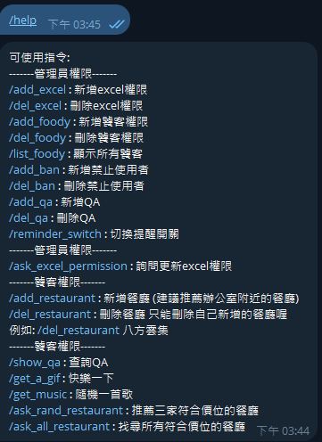
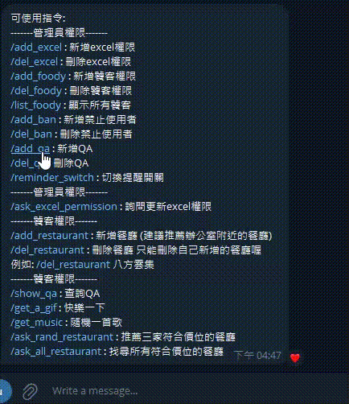

# Telegram office bot

### 簡單說明一下這東西的起因:
##### 這是一個簡單的tg robot, 一開始只是為了讓我合作的企劃不需要每次更新設定檔的時候都要詢問我, 所以做了讓他們上傳excel之後點選更新環境的功能,點選之後就會觸發bat更新設定檔並commit & push,當時我也把後面的cd部分架好了,因此實現更新設定檔自動化
##### 後來上班閒暇之餘開始玩TG給的API，做一些開晨會通知之類的功能
#### 做著就發現這東西越來越大的同時可以拿來當作我練習設計的項目
*已經把跟前公司比較有關的東西拿掉了*

## 使用方式
* 增加tgbot.conf文件在此root下，將自己申請的tgbot的token貼上去
* 將自己的群組id貼到 TEST_GROUP_ID (要使用官方api:getUpdate去取值)

## feature
* /help: (admin看到的)

* /add_excel: /add_excel xxxxxxxx(id) xxx(name)
* /del_excel: /del_excel xxxxxxxx(id)
* /add_foody: /add_foody xxxxxxxx(id) xxx(name)
* /del_foody: /del_foody xxxxxxxx(id)
* /list_foody: 直接點選
* /add_ban: /add_ban xxxxxxxx(id) xxx(name)
* /del_ban: /del_ban xxxxxxxx(id)
* /add_qa: 點選進入交互模式
* /del_qa: 點選進入交互模式 
* /reminder_switch: 直接點選
* /add_restaurant: 點選進入交互模式 
* /del_restaurant: 如圖 
* /show_qa: 直接點選
* /get_a_gif: 點選後隨機拿到圖庫中的一張gif(如果bot已經上傳過 會從紀錄中的cache裡面取 bot不會重複上傳)
* /get_music: 點選後隨機取得一首音樂庫裡的歌 (同上)
* /ask_rand_restaurant: 直接點選
* /ask_all_restaurant: 直接點選

### 交互模式範例

## TODO
1. 全部東西都改成交互模式:實現操作直覺化
2. callback優化:目前callback都是分析點選所回傳的string，導致要一直分析string，在思考能不能用交互模式的概念解決
3. foody & qa module化:有些類似功能會使用到相似function，能使用parent class的話之後會比較好擴建
4. 使用者增加提醒功能: 目前的reminder要寫死在code裡
5. 自由新增群組: 目前都要寫死在code裡
6. 增加redis儲存方案: 目前直接使用save.json儲存 (會在conf列為可選可不選，畢竟小東西還要架redis有點多此一舉)
7. 使用edit去修改最後一個bot對話: 目前是使用delete & add 來避免callback一直被呼叫
8. ~~大量的重構~~

## 一些心得
1. tgbot每一次的req & resp 都要經過tg自己的server, 他們的server一次只讓tgbot做一次req & resp, 完成之後才能執行下一個，如果tgbot一次resp兩個msg, tg server 會暫時把tgbot鎖住, 因此tgbot是個先天性的single thread, 因此tgbot其實不適合拿來上傳檔案及多人大量使用
2. 如果要實現併發，可能要自己建一個模擬client端，自己建一個server，但可能會被telegram鎖，並且沒辦法使用telegram原本就給予tgbot的一些好用管理功能，也不確定那些可以出現選項來點選的api要怎麼實現